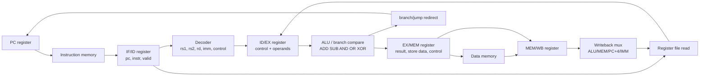

# Phase 5 Pipeline Waveform Guide

Open the curated waveform view:

```powershell
gtkwave sim\phase5_pipeline_trace.vcd reports\sim\phase5_pipeline_structure.gtkw
```

The save file groups signals by pipeline function instead of raw hierarchy. It is meant for answering three questions quickly:

1. Is each instruction moving through IF, ID, EX, MEM, and WB?
2. Is decode producing the right control for the instruction in ID?
3. Is the EX/ALU path using the expected operands and result?

## Pipeline Structure



## What To Look For

### Instruction movement

Use the architectural trace group first:

- `trace_if_pc`, `trace_if_instr`, `trace_if_valid`
- `trace_id_pc`, `trace_id_instr`, `trace_id_valid`
- `trace_ex_pc`, `trace_ex_instr`, `trace_ex_valid`
- `trace_mem_pc`, `trace_mem_instr`, `trace_mem_valid`
- `trace_wb_pc`, `trace_wb_instr`, `trace_wb_valid`

A normal instruction should appear in IF, then ID, then EX, then MEM, then WB on successive cycles.

### Decode behavior

Use the decoder group:

- `u_decoder.instr`
- `opcode`, `funct3`, `funct7`
- `rs1`, `rs2`, `rd`
- `imm`
- `reg_write`, `mem_write`, `branch`, `jump`, `jump_reg`
- `alu_src_imm`, `alu_src_pc`, `alu_op`, `wb_sel`

This shows whether the instruction in ID is being interpreted correctly.

### ALU behavior

Use the EX/ALU group:

- `ex_alu_a`
- `ex_alu_b`
- `id_ex_alu_op`
- `ex_alu_y`
- `u_alu.a`, `u_alu.b`, `u_alu.alu_op`, `u_alu.y`

The `ex_*` signals are the core-level ALU path. The `u_alu.*` signals confirm what the ALU module sees internally.

### Branch and jump redirects

Use:

- `trace_redirect`
- `trace_flush`
- `trace_redirect_target`
- `ex_branch_target`
- `ex_jalr_target`
- `ex_branch_equal`

When a branch or jump is taken, `trace_redirect` and `trace_flush` pulse and the PC moves to `trace_redirect_target`.

### Writeback

Use:

- `mem_wb_wb_sel`
- `mem_wb_rd`
- `wb_data`
- `wb_we`
- `trace_wb_rd`
- `trace_wb_wdata`
- `trace_wb_we`

This is the fastest place to debug wrong final register values.
